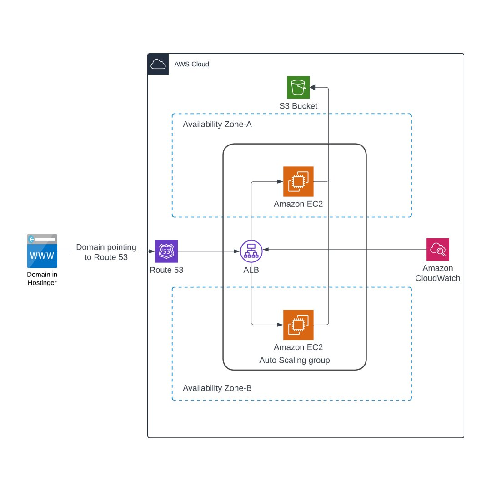

# AWS BeanStalk Application Architecture 

---

This diagram represents a typical architecture for deploying a highly available web application on AWS (Amazon Web Services). Let's break down the components and their roles:

1. *Domain in Hostinger*: 
   - This represents a domain name registered with Hostinger (or any other domain registrar).
   - The domain is pointing to AWS Route 53, which is a DNS (Domain Name System) web service.

2. *Route 53*:
   - AWS Route 53 is used to manage DNS settings. It routes end-users to your application based on the domain name.
   - It connects the domain name (hosted in Hostinger) to your application by resolving the domain name to the appropriate IP address or service.

3. *ALB (Application Load Balancer)*:
   - The Application Load Balancer (ALB) distributes incoming application traffic across multiple EC2 instances in different Availability Zones, ensuring high availability and fault tolerance.
   - It also provides features like SSL termination, user authentication, and request routing based on URL paths.

4. *Amazon EC2 Instances*:
   - These are virtual servers in the AWS cloud that run your application. 
   - The diagram shows multiple EC2 instances spread across two Availability Zones (A and B). This setup provides redundancy and ensures that your application remains available even if one zone fails.

5. *Auto Scaling Group*:
   - The Auto Scaling Group ensures that the correct number of EC2 instances are running to handle the load on your application. 
   - If traffic increases, it can automatically launch more instances, and if traffic decreases, it can terminate instances to save costs.

6. *S3 Bucket*:
   - Amazon S3 is a storage service. In this architecture, it may be used to store static assets like images, videos, or backups that are used by the application.
   - S3 can also be used for website hosting, serving static files, or as a backup solution.

7. *Amazon CloudWatch*:
   - CloudWatch is a monitoring and management service that collects operational data in the form of logs, metrics, and events.
   - It provides visibility into resource utilization, application performance, and overall health of your AWS resources. CloudWatch can trigger alarms and take automated actions (e.g., scaling up instances) based on defined thresholds.

8. *Availability Zones (A and B)*:
   - Availability Zones (AZs) are isolated locations within an AWS Region. They provide physical separation and redundancy.
   - By deploying resources in multiple AZs, the architecture ensures higher availability and resilience against failures.

### How it Works:
- Users access your application via the domain name, which is managed by Route 53.
- Route 53 routes the request to the ALB.
- The ALB balances the incoming traffic across the EC2 instances in multiple Availability Zones.
- The EC2 instances process the requests, potentially retrieving or storing data in the S3 bucket.
- CloudWatch monitors the entire setup, providing insights and triggering actions like auto-scaling to handle changes in traffic.

This architecture is designed for scalability, high availability, and fault tolerance, making it well-suited for modern web applications.
